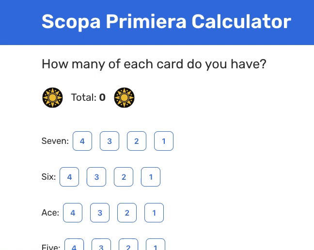

# Scopa Primiera Calculator

[Link to Demo](https://andreidobrinski.com/scopa)

A site to help you calculate your primiera score in Scopa.

- Input the amount of each card you have
- See the subtotal for each card value
- See the total of all cards

## Running Locally

1. Clone this repo
2. Install dependencies

```
cd scopa
npm install
```

3. Start the development server

```
npm start
```

4. Open localhost:8080 in your browser

## Technologies Used

- [React](https://reactjs.org/)
- [Gatsby](https://www.gatsbyjs.com/)
- [Styled Components](https://styled-components.com/)

## Resources

- [Scopa Wiki](https://en.wikipedia.org/wiki/Scopa)
